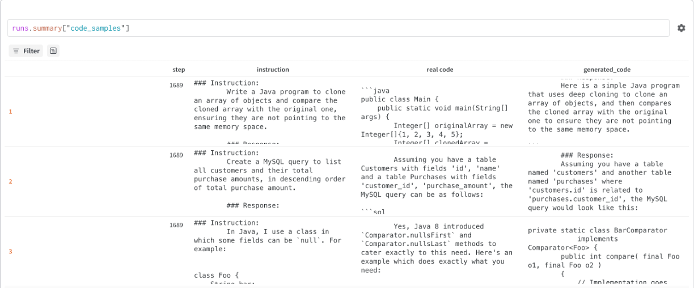

# LLM QLoRA Fine-tuning for Code Generation

A proof-of-concept pipeline that teaches Llama 3.1 8B to follow coding instructions 
using QLoRA — a memory-efficient fine-tuning technique that trains approximately 1% of 
model parameters by adding small trainable adapter layers to a frozen, 4-bit 
quantised base model.

## Model

**Base model:** [meta-llama/Llama-3.1-8B](https://huggingface.co/meta-llama/Llama-3.1-8B)  
**Fine-tuned adapter:** [Manahil0/llama-3-1-8b-code-qlora](https://huggingface.co/Manahil0/llama-3-1-8b-code-qlora)

## Training

| Parameter | Value |
|---|---|
| Method | QLoRA (r=32, α=32) |
| Training dataset | [Magicoder-Evol-Instruct-110K](https://huggingface.co/datasets/ise-uiuc/Magicoder-Evol-Instruct-110K) |
| Training samples | 10,000 |
| Epochs | 3 |
| Learning rate | 1e-4 |
| Hardware | Google Colab Pro (A100 GPU) |

## Evaluation

Evaluated on **HumanEval** and **[HumanEval+](https://github.com/evalplus/evalplus)**

| Model | HumanEval Pass@1 | HumanEval+ Pass@1 | 
|---|---|---|
| Llama 3.1 8B zero-shot (baseline) | 30.5% | 26.8% |
| Llama 3.1 8B + QLoRA (ours) | 35.4% | 32.3% |

*Note: base model (not instruct) used as starting point - instruct version 
leaves less room for improvement via fine-tuning.*

## Experiment Tracking

📊 [View W&B Training Report](https://api.wandb.ai/links/manahil/8jwxe4w0)

Training curves and qualitative code generation samples logged throughout training:



## Repository Structure

```
├── configs/
│   └── qlora_config.yaml      # All hyperparameters and dataset settings
├── data/
│   └── prepare_data.py        # Download and preprocess Magicoder dataset
├── train.py                   # QLoRA fine-tuning with W&B logging
├── baseline.py                # Zero-shot baseline evaluation
├── evaluate.py                # Fine-tuned model evaluation and comparison
├── results/
│   └── figures/               # Training curves and qualitative examples
├── .github/workflows/
│   └── eval.yml               # CI — syntax checks on every push
└── requirements.txt
```


## 🚀 Usage

**1. Install dependencies:**
```bash
pip install -r requirements.txt
```

**2. Prepare training data:**
```bash
python data/prepare_data.py --config configs/qlora_config.yaml
```

**3. Run zero-shot baseline:**
```bash
python baseline.py --config configs/qlora_config.yaml --dataset humaneval
```

**4. Fine-tune the model:**
```bash
python train.py --config configs/qlora_config.yaml
```

**5. Evaluate fine-tuned model:**
```bash
python evaluate.py --config configs/qlora_config.yaml --dataset humaneval
```

All hyperparameters, dataset settings and evaluation options are controlled 
from `configs/qlora_config.yaml` — change dataset size, LoRA rank, learning 
rate, or number of epochs without touching the code.

## ⚙️ MLOps

| Tool | Purpose |
|---|---|
| Weights & Biases | Experiment tracking, loss curves, code sample logging |
| HuggingFace Hub | Model registry — fine-tuned adapter publicly available |
| GitHub Actions | CI pipeline — syntax checks on every push |
| YAML config | Single config file controls all hyperparameters |
